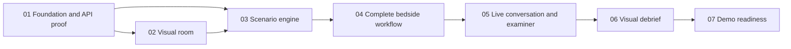

# Implementation phases

[Product specification](../../specs.md) · [Repository overview](../../README.md)

All phases are **not started**. Each phase has a bounded outcome, explicit dependencies, implementation tasks, and verification gates that can be checked before proceeding. These are incremental checkpoints; later phases build on earlier ones.

The specification defines product behavior and scope. Phase documents define execution and verification. Update both if an implementation decision changes product behavior.

| Phase | Outcome | Depends on | Status |
|---|---|---|---|
| [01 — Foundation, case contract, and API proof](01-foundation-and-api-proof.md) | An application skeleton and independently runnable probes establish the project structure and both real provider integrations. | None. | Not started |
| [02 — Visual room and bedside interaction slice](02-room-and-bedside-interaction.md) | A student can use the room to connect monitoring and complete a medication interaction against an explicitly labeled fixture-backed server. | Phase 01. | Not started |
| [03 — Deterministic scenario engine and treatment rules](03-deterministic-scenario-engine.md) | Patient physiology, observations, treatments, and timers are driven by reproducible server rules and reflected consistently in the room. | Phase 01; integrate with the Phase 02 room before closing this phase. | Not started |
| [04 — Complete assessment, treatment, and handoff workflow](04-complete-bedside-workflow.md) | One complete student run can be performed through room and HTML controls, using text before full voice orchestration. | Phases 02 and 03. | Not started |
| [05 — Grounded live conversation and examiner checkpoints](05-live-conversation-and-examiner.md) | Live conversation and the persistent examiner session use actual run evidence while respecting treatment and information boundaries. | Phases 01, 03, and 04. | Not started |
| [06 — Visual debrief, evidence replay, and formative assessment](06-visual-debrief-and-evidence.md) | Every run ends with a consistent evidence cutoff and a visual account of what the student assessed, administered, observed, and explained. | Phases 03, 04, and 05. | Not started |
| [07 — Reliability, polish, and presentation readiness](07-reliability-and-demo-release.md) | A clean checkout can produce a reliable, visually complete demonstration with recovery controls and inspectable integration evidence. | Phases 01–06. | Not started |

## Dependency order

Engine development can begin after Phase 01, but Phase 03 cannot close until its monitor/room integration from Phase 02 passes. Follow the numbered order for a straightforward build.

## Completion rules

- Use `Not started`, `In progress`, `Blocked`, or `Complete` consistently here and in each phase document.
- Keep implementation checkboxes separate from verification checkboxes. Working code alone does not establish a passed gate.
- Record actual commands/manual steps, environment, outcomes, and evidence paths in each phase's verification record.
- A fixture or mock can prove isolated UI/engine behavior only where explicitly allowed. Real API and final integrated-run gates require real connections.
- Clinical review is distinct from software verification. Unreviewed clinical fixtures must remain labeled and cannot satisfy clinical acceptance gates.
- A blocked gate remains unchecked with a concrete reason and next action. Complete other independent tasks without claiming phase completion.
- Keep secrets and identifiable patient data out of logs and commits. The scenario uses a fictional patient.
- Do not create new tests merely to count checkboxes; use focused tests for engine/data integrity and manual visual checks where appropriate.

The project is ready for demonstration when all seven phases are complete and the Phase 07 release evidence is recorded.
