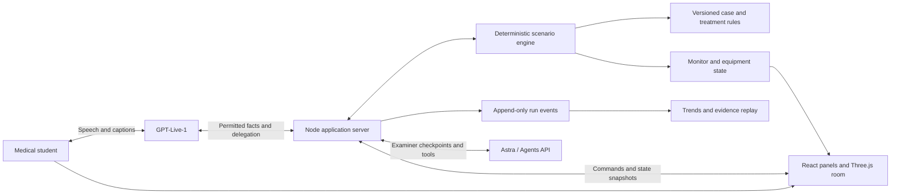

# DO NO HARM — product specification

Updated 13 September 2026. Authoritative product specification; implementation has not started.

See [implementation phases](docs/phases/README.md) for dependency order, deliverables, and individually verifiable acceptance gates. This document defines the product; phase documents define how to build and verify it.

**Build a visually convincing emergency room where a medical student assesses a fictional patient, operates bedside equipment, selects and administers medication doses, sees the patient's response, and receives feedback tied to what they actually did.**

A complete practice session takes 6–8 minutes. A presenter can demonstrate its essential interactions in three minutes. GPT-Live-1 provides natural conversation; Astra through the Agents API examines the student's reasoning and actions. A deterministic application engine controls clinical state and treatment effects.

## 1. Product outcome and scope

The core loop is **assess → interpret → act → observe → reassess → escalate → debrief**. Speaking, clicking equipment, setting treatment parameters, and documenting all contribute to the examination. A spoken intention alone never administers a treatment.

Build one polished emergency bay, one adult chest-pain case, and three authored paths: timely care, delayed care, and an inappropriate medication attempt. All paths reach a useful debrief, including incomplete runs. The student works in a simulated supervised role: student-permitted actions execute directly; actions requiring senior authorization have an explicit simulated request and response.

The demo is complete when an audience can see the student connect monitoring, inspect an ECG, enter a medication dose and route, administer it, observe an authored response or lack of immediate response, and explain the next step. The debrief must connect those actions to the monitor trend and the student's reasoning.

Required scope:

- A Three.js emergency bay with a patient, functioning monitor, oxygen station, IV equipment, medication trolley, ECG machine, clipboard, and call station.
- Continuous ECG and pulse-oximeter waveforms, readable measurements, alarms, and trends linked to case state.
- Direct interaction with assessment, investigations, medication administration, treatment settings, and reassessment.
- Conversational patient history and a simulated nurse/facilitator, with clearly labeled speaking roles.
- One source-backed, clinically reviewed scenario with explicit dosage rules, treatment prerequisites, and time-dependent branches.
- Notes, senior handoff, one examiner follow-up, and an evidence-linked visual debrief.
- Reset, accessible HTML controls, text fallback, and exportable run evidence.

Defer free walking, avatar rigging, procedural cases, general pharmacology simulation, a full hospital record system, accounts, dashboards, multiplayer, multiple cases, and full cardiac-arrest resuscitation. Medication administration and responsive physiology are core features and cannot be cut to meet the demo deadline.

## 2. Room design and visual hierarchy

Use a fixed three-quarter camera at the foot of the bed with short focus transitions when equipment is selected. Build recognizable equipment with simple geometry and restrained materials. Prioritize lighting, readable instruments, and coherent equipment placement over photorealism.

The patient occupies the center; the heart monitor sits near the patient's head and remains visible during treatment. Place oxygen and suction on the wall, IV equipment beside the bed, the medication trolley in the foreground, and the ECG/results workstation on the opposite side. The door and senior-call station establish the emergency setting. Every highlighted object performs a useful action.

```text
┌───────────────────────────────────────────────────────────────────────────┐
│ DO NO HARM   Emergency Bay 01   Simulation 02:14   Mic ●   Pause   Finish │
├──────────────────────────────────────────────┬────────────────────────────┤
│                                              │ BEDSIDE MONITOR            │
│  Oxygen / suction      Heart monitor         │ ECG   continuous trace     │
│        IV pole        ┌──────────────┐       │ HR    SpO₂    RR           │
│                       │ Patient/bed  │       │ BP + measurement time      │
│  Medication trolley   └──────────────┘       │ Alarm state / trend        │
│                                              ├────────────────────────────┤
│  ECG workstation           Senior call      │ ACTIVE EQUIPMENT PANEL     │
│                                              │ Drug / dose / unit / route │
│           Interactive 3D emergency bay        │ Prerequisites and history  │
│                                              │ Review → Administer        │
├──────────────────────────────────────────────┴────────────────────────────┤
│ Patient: “The pressure started while I was resting.”   [Captions / text]  │
├───────────────────────────────────────────────────────────────────────────┤
│ Assess | Monitor | ECG/Labs | Oxygen/IV | Medication | Notes | Call senior │
└───────────────────────────────────────────────────────────────────────────┘
```

This is a layout specification, not a screenshot of an implemented app. Target a 1440×900 laptop and a 16:9 projector; support 1280×720 without hiding primary actions. On smaller screens, stack the room and panels while retaining the monitor summary.

Use a muted blue-gray room, warm patient lighting, and high-contrast clinical panels. Waveforms use distinct colors plus text labels; alarms always include text and an icon. Focus/hover outlines identify equipment. Show oxygen tubing and IV connection state, a cuff inflation animation, trolley selection, and subtle patient breathing/distress changes. Treatment receipts and device changes should appear immediately after server acceptance.

HTML panels overlay the canvas and provide keyboard navigation, visible focus, screen-reader labels, and the same actions as hotspots. Support reduced motion and muted audio. Keep captions clear of the patient and primary controls. Avoid displaying the hidden diagnosis, expected next action, or grading checklist during assessment.

## 3. Authored scenario and progression

**Working case: adult with acute chest pain and evolving instability.** The student must obtain a focused history, assess the patient, establish monitoring, interpret a 12-lead ECG, select appropriate initial measures, reassess, and seek urgent senior help.

Author the patient's age, weight in kg, symptom onset, pain description, allergies, medication history, relevant comorbidities, examination findings, ECG, and investigation timing in a versioned case pack. Select one coherent clinical presentation; have a clinical reviewer validate the whole case, including acceptable alternatives, before presenting its scoring as educationally validated.

Use the [Resuscitation Council UK ABCDE approach](https://www.resus.org.uk/library/abcde-approach) as an initial assessment reference. The implementation must name its chosen local clinical protocol and revision; location-specific dosing and escalation details belong in that case pack.

| Phase | Student experience | Engine behavior |
|---|---|---|
| Arrival | Nurse/facilitator states the authored voice briefing (role, patient identity, complaint, visible appearance, task), then the patient may speak the opening line; unconnected measurements display “not connected” | Establish baseline physiology and simulation clock; reveal only observable findings; do not release unelicited history |
| Initial assessment | Ask history, examine, attach sensors, measure BP, request ECG | Release authored findings and start acquisition timers |
| Decision | Interpret ECG, check contraindications, prepare medication, choose supportive measures | Validate prerequisites and treatment parameters; record proposed and completed actions separately |
| Timely care | Administer eligible treatment, reassess, request senior support | Apply only authored effects after their specified delays; acknowledge escalation |
| Delayed care | Leave important assessment/treatment/escalation steps incomplete | Trigger a bounded deterioration branch with changed observations and alarm conditions |
| Inappropriate attempt | Select an unsuitable drug, dose, route, or duplicate treatment | Record the attempt; apply the case's reviewed block/warning rule; explain in debrief |
| Handoff and closure | Summarize the situation, defend reasoning, finish | Freeze the case at a consistent evidence cutoff and generate feedback |

These phases are not a mandatory click sequence. Accept clinically equivalent action orders and allow reassessment at any time. Delayed-care deterioration must follow explicit scenario rules, not a model's judgment or a random timer. An adverse-effect branch may run only when its medication rule and consequence have been reviewed; otherwise block the unsupported action and record the attempt.

Implement each branch with entry conditions, observation changes, treatment effects, effect delays, exit conditions, and timeout behavior. Separate underlying physiology from measurements: the patient has a physiological state even when the sensors are disconnected. A stale BP value remains timestamped until remeasured.

Do not make every treatment improve every vital sign. An antiplatelet action, for example, must not function as an instant pulse/BP reset. Escalation produces an acknowledgment and disposition plan rather than automatically curing the patient. The successful outcome is appropriate initial management and transfer of responsibility, not guaranteed normalization of the monitor.

## 4. Equipment and student interactions

| Object | Required student controls | Visible consequence and evidence |
|---|---|---|
| Patient/bed | Ask focused questions; inspect breathing/perfusion; check pulse; assess pain and consciousness | Authored answers and exam findings; each assessment timestamped |
| Heart monitor | Attach ECG leads and SpO₂ probe; apply BP cuff; start/repeat BP measurement; inspect rhythm strip/trends; acknowledge alarm | Connected sensors reveal measurements; waveform and numerical values share the same state; acknowledged alarms remain visibly active while unresolved |
| ECG machine | Request, acquire, and open 12-lead ECG; zoom image; enter interpretation | Separate request/ready/open events; clinically reviewed ECG artwork with calibration and lead labels; authored report also available |
| Oxygen station | Select device; set flow in L/min or device-specific setting; apply, adjust, and stop | Tubing/device state, current setting, administration event, and case-defined response |
| IV station | Establish simulated access; inspect patency; select available fluid, volume in mL, and rate in mL/h where relevant; start/stop | Line/bag state, elapsed delivery, cumulative delivered volume, and authored response |
| Medication trolley | Inspect chart/allergies and prior doses; select drug/formulation; enter dose, unit, route, and timing; review and administer | Administration receipt, cumulative dose, monitoring prompts, and scheduled effect if defined |
| Results workstation | Request and inspect case-specific blood tests; view collection/availability times | Pending/available states; no instant or invented lab results |
| Clipboard | Record assessment, working diagnosis, rationale, and plan; save/revise | Exact note revisions tied to the event timeline |
| Call station | Request senior review; give structured spoken/text handoff; request supervised actions | Request, acknowledgment, actual handoff content, and simulated authorization recorded distinctly |

Unsupported equipment settings or drugs should be absent from the active formulary or visibly unavailable. If a student asks for an unsupported investigation, acknowledge that it is outside this case without inventing a result. Suction can be visible set dressing with an explicit unavailable state for this chest-pain case; do not suggest it has a working procedure panel.

### Monitor behavior

Render a continuous ECG strip and pulse-oximeter plethysmogram, HR, SpO₂, respiratory rate, intermittent BP, and a compact trend view. Include units, measurement age, sensor status, and alarm status. A disconnected sensor produces a labeled unavailable trace/value, never a false zero or an apparent flatline.

Derive ECG beat timing and displayed HR from the same simulation state. Use authored rhythm templates; the bedside rhythm strip is distinct from the diagnostic 12-lead ECG. Alarm thresholds and rhythm changes come from the case. Acknowledgment silences audio temporarily but does not clear the underlying condition. Pause stops simulated time, waveforms, and treatment delivery together.

### Medication and dosage workflow

1. Open the trolley and inspect patient identity, allergies, current observations, and administration history.
2. Select a medication and formulation from the small case formulary.
3. Enter a numeric dose and explicit unit; choose route. For relevant formulations, include concentration and derived volume, or rate and duration. Weight-based calculations use the authored weight and show their arithmetic.
4. Review a plain-language order summary, required checks, and any senior authorization state.
5. Click **Administer** to execute. Speaking or saving an order creates a draft only; voice-drafted parameters remain visible for confirmation.
6. Receive an administration receipt with simulation time, dose, route, actor, and status. Reassess the patient; inspect actual changes and previous doses before repeating treatment.

A concrete initial formulary entry is aspirin: the RCUK reference specifies **300 mg orally, crushed or chewed** in its chest-pain assessment guidance. Use that only as a sourced case-authoring example, subject to the chosen protocol and patient contraindications; it is not a universal dose default. The learner must enter the dose rather than having the answer prefilled. [Source: RCUK ABCDE approach](https://www.resus.org.uk/library/abcde-approach).

Add a nitrate and an analgesic only with reviewed doses, routes, contraindications, repeat intervals, maximum cumulative doses, and plausible response rules. Oxygen and fluids need reviewed settings too. The minimum demo requires one fully authored medication administration and one supported inappropriate attempt; additional drugs deepen the case after that loop works.

Each formulary record contains: identifier/name, formulation, allowed units/routes, reference dose rule, contraindications, required observations/access, authorization rule, repeat interval, cumulative limit, onset/duration, effect rule, reassessment requirement, clinical source/revision, and review status. Keep expected-dose rules and rubric content on the server. Show product concentration and patient information without exposing the answer key.

Reject malformed input, missing units, unsupported routes, nonpositive quantities, and impossible calculations. For clinically inappropriate but syntactically valid choices, use explicit case-authored block/warning rules. Record attempted, blocked, canceled, authorized, administered, and stopped as separate statuses. Prevent double administration from retries, double clicks, or simultaneous voice and UI requests.

## 5. Conversation and examiner behavior

GPT-Live-1 starts the conversation with the authored **voice briefing**, supports interruptions, voices authored patient answers, acknowledges completed actions, and delivers the examiner's follow-up/debrief. A role label identifies **Patient**, **Nurse**, or **Examiner**; one voice is sufficient initially. The first spoken turn is Nurse/facilitator. Patient answers contain only information the patient could know. Equipment findings come from the application state.

The voice briefing is case-pack copy (`voiceBriefing`), not model-invented. It must mention the student-visible **requirements of this run** and nothing that belongs in history-taking or the hidden rubric:

Must include:

- That this is a formative emergency simulation and the learner is the medical student at the bedside
- Patient identity, age, presenting complaint, and currently visible appearance
- The task: assess and manage the patient, then ask what they want to do

Must not include:

- Unelicited history (onset, radiation, associated symptoms, medications, comorbidities, full allergy narrative)
- Expected next actions, ABCDE as a script, drug names, doses, routes, or “get an ECG first”
- Hidden diagnosis, rubric criteria, or grading language

Chest-pain briefing (authoritative until the case pack is revised):

> This is a formative emergency simulation. You are the medical student at the bedside. The patient is Morgan Lee, 58 years old, with central chest pressure, pale and clammy. Assess and manage the patient. What do you want to do?

After that stem, the student obtains the focused history by asking. The patient's opening line remains a first-person utterance, not a substitute for the briefing. The facilitator does not menu the next clinical step. Available equipment is in the room; the student chooses.

The student can say “prepare aspirin” to open a draft medication panel. Missing or ambiguous dose/route information stays unfilled and requires clarification. Neither voice nor examiner tools can bypass the final administration control or change physiology directly.

Astra examines history-taking, interpretation, intervention choices and parameters, reassessment, escalation, and documentation. Give it meaningful event batches rather than every monitor tick. During active treatment, avoid interrupting the student with exam questions. Ask at most one neutral follow-up after handoff or when the student explicitly enters the reasoning checkpoint.

The strongest demo moment is observable: the student says a treatment was given, but the timeline shows only a prepared order. The examiner can ask, “Talk me through what has been administered so far.” If the run supports it, the debrief opens the unexecuted order and the handoff claim side by side. If there is no discrepancy, ask about the rationale for an actual decision.

## 6. Architecture and API responsibilities



Use TypeScript, React, Three.js, and one Node backend. Put the application in `client/`, `server/`, `case/`, and `shared/`, with protocol/source notes in `docs/`. Confirm dependency versions during implementation. One deployment serves the built client and backend; keep provider credentials on the server.

**Voice:** GPT-Live-1 over browser WebRTC, using the connection pattern in the [GPT-Live guide](https://developers.openai.com/api/docs/guides/live). Confirm project access with a real session before integrating the complete conversation.

**Examiner:** one managed `gpt-6-astra` Agents API session per run, continued at assessment, treatment, handoff, and debrief checkpoints. Use the [Agents API documentation](https://developers.openai.com/api/docs/guides/agents-api/overview) to implement session input and tool handling. Verify model access and exact SDK/API contracts during the first integration milestone. An SDK wrapper alone does not establish use of the Agents API.

Proposed application tools:

| Tool | Responsibility |
|---|---|
| `get_case_fact(key)` | Return a currently releasable authored finding |
| `get_visible_state()` | Return connected measurements, equipment settings, and published results |
| `prepare_action(kind, parameters)` | Open an unexecuted student-visible draft; cannot administer |
| `get_evidence(filter)` | Read actual transcript, action, observation, and note events |
| `submit_examiner_output(kind, payload, evidence_ids)` | Submit structured follow-up or feedback for server validation |

Separate tool permissions for facilitator and examiner. Treat student text as evidence, not application instructions. The server validates tool arguments, releasable facts, evidence references, and output schemas. Only server-validated student commands mutate treatment state.

## 7. Simulation state, timing, and evidence

Keep session lifecycle (`ready → active → handoff → debrief → ended`) separate from clinical state and device state. Clinical progression continues during handoff until the run is paused or ended. Store authoritative state in the server with monotonically increasing revisions.

Use one simulation clock for acquisition delays, deterioration, medication onset, repeat-dose intervals, and fluid delivery. Render waveforms smoothly in the browser from timestamped snapshots; do not let animation frames drive clinical events. Presenter time compression is explicit, recorded, and consistent across all timers. API latency never advances an authored treatment effect by itself.

Each event includes `id`, `runId`, `sequence`, `wallTime`, `simulationTime`, `actor`, `type`, `payload`, `stateVersion`, `caseVersion`, and optional `causedBy`/`idempotencyKey`. Medication events also preserve entered parameters, normalized quantities, validation result, and administration status. Persist events and case snapshots to a local run file for replay; deployment-restart durability and cross-device sessions are outside this demo's scope.

Distinguish requested, performed, available, displayed, interpreted, prepared, and administered. Looking at a result is evidence of access, not comprehension. Preserve transcript corrections and note revisions without overwriting history. Record prompts and assisted answers separately from unassisted performance.

Serialize treatment mutations, reject stale commands, and deduplicate retries. Resynchronize the UI from the server after reconnecting. Run one examiner turn at a time; invalidate stale feedback when later evidence changes its basis. On Finish, freeze simulation, settle accepted actions, save the note, drain available final transcript events with a bounded timeout, and grade a named evidence cutoff. Mark transcript gaps as unavailable evidence; late corrections require a new feedback revision.

## 8. Visual debrief and assessment

The debrief is a visual reconstruction of the student's decisions:

- A vital-sign trend chart with markers for assessment, medication dose/route, oxygen/IV changes, alarms, and senior contact.
- A chronological action list showing attempted, blocked, prepared, and completed treatments distinctly.
- Clickable evidence cards opening the exact ECG/result, note revision, transcript excerpt, or administration receipt.
- One strength, one priority improvement, and one next-practice objective.
- A short spoken explanation followed by an optional teach-back question, explicitly marked assisted.

Use six criteria: assessment, interpretation, intervention selection/dosing, reassessment, escalation, and communication/documentation. Return `demonstrated`, `needs_work`, or `insufficient_evidence`, a concise reason, and validated evidence IDs for each. Do not make viewing every object a scoring requirement or penalize an acceptable alternative sequence.

Separate observed events from interpretation. Feedback may say the student did not repeat BP before the evidence cutoff if the log supports that; it must not invent an adverse outcome. Charts show authored simulation responses and do not claim patient-specific predictive accuracy. Label feedback as formative practice.

## 9. Reliability and demo controls

Keep the monitor and local controls responsive while the examiner works. On voice failure, preserve the run and expose reconnect plus text entry. Pause the simulation automatically if server synchronization is lost; show stale measurements until resynchronized. On evaluator failure, retain evidence and offer retry, displaying “evaluation unavailable” instead of invented feedback.

If WebGL is unavailable, use the same functional HTML panels and monitor with a clear reduced-graphics message. A fallback run remains inspectable but does not count as successful delivery of the visual room milestone.

Presenter controls, separate from student controls, provide reset to a fresh run, explicit pause/resume, time compression, and branch selection before Start. All presenter interventions are recorded and excluded from student credit. A reset clears devices, orders, doses, clocks, notes, transcript, and provider sessions. Record a real successful run as a labeled video backup.

Keep a presenter-only integration view showing session/model identifiers, tool calls, timestamps, and success/error status. Export a compact run JSON without secrets or hidden model reasoning. The student interface should contain only clinically meaningful information and connection status.

## 10. Build sequence and acceptance gates

Use milestones rather than promising a complete interactive simulator within a few hours. Reserve at least the final quarter of build time for clinical content checks, integration testing, and rehearsal.

| Milestone | Deliverable | Acceptance gate |
|---|---|---|
| 1. Case contract and API proof | Draft case schema, clinical review checklist, real Live and Astra connections | Speech round trip and real examiner tool call succeed; uncertainty about access is resolved |
| 2. Visual interaction slice | Lit emergency bay, patient, connected monitor, one working medication panel | Student attaches sensors, enters dose/route, administers, and sees matching equipment state and receipt |
| 3. Scenario engine | Timers, measurements, authored treatment effects, three paths | Identical commands and simulation times reproduce identical state; delayed and blocked-action branches work |
| 4. Complete bedside workflow | Assessment, ECG, oxygen/IV, case formulary, history, notes, and senior call | One case runs from arrival to handoff entirely through working room/HTML controls |
| 5. Conversational examination | Grounded facts, voice drafts, examiner checkpoints | Voice cannot bypass execution rules; follow-up references the current run |
| 6. Evidence debrief | Trends, action timeline, evidence cards, spoken feedback | Every feedback reference resolves; attempted versus administered treatment is correctly represented |
| 7. Polish and rehearsal | Responsive layout, alarm audio, accessibility, recovery, recording | Complete good, delayed, and inappropriate-attempt runs; reset and failure paths pass |

Verify the engine with focused tests for clock/pause behavior, unit conversion, cumulative dose and repeat intervals, authorization, duplicate commands, delayed results, and branch transitions. Verify monitor values/beat timing remain consistent across state changes. Run browser checks for the medication workflow, keyboard controls, reconnect, Finish cutoff, evidence links, and reset isolation. Review ECG content and treatment rules as clinical content, separately from software tests.

Performance targets: smooth room/waveforms on the presentation laptop; readable panels at 1280×720; visible command acknowledgment within 300 ms on the demo deployment under normal conditions; no rendering dependency on model response time. Measure these during rehearsal rather than claiming them in advance.

Cut decorative props, ambient sound, elaborate patient animation, dictation, extra drugs, and extra investigations first. Preserve the functional room, monitor, dosage entry and administration, responsive scenario, live voice, actual examiner integration, and visual evidence debrief.

## 11. Three-minute presentation

| Time | Audience sees |
|---|---|
| 0:00–0:20 | Emergency bay opens; Nurse speaks the authored briefing (simulation, student role, Morgan Lee, 58, chest pressure, pale and clammy, assess and manage); patient may then speak; student starts assessment |
| 0:20–0:45 | Student connects monitoring, measures BP, and acquires/opens the ECG |
| 0:45–1:20 | Student checks medication history, enters dose and route, reviews, and administers; receipt appears |
| 1:20–1:45 | Student observes the authored trend, reassesses, and adjusts a relevant supportive treatment |
| 1:45–2:05 | Student saves a short note and gives a senior handoff; examiner asks one grounded question |
| 2:05–2:45 | Debrief overlays interventions on vital trends and opens the exact dose/action evidence |
| 2:45–3:00 | Presenter shows real API/tool receipts and explains the division of responsibilities |

Rehearse a separate inappropriate-dose attempt to demonstrate validation without forcing an error into every presentation. If time compression is needed, label it on screen; never imply a medication acts instantly to fit the presentation.

The target integrations are GPT-Live-1 and the Agents API. Confirm any competition categories, judging rubric, submission artifacts, and duration limits with the organizer before preparing submission materials; none are established by this plan.

**Pitch:** “DO NO HARM puts medical students at the bedside: assess the patient, operate the monitor, choose and administer treatment, then see how their decisions unfolded—with an examiner that can point to the evidence.”
